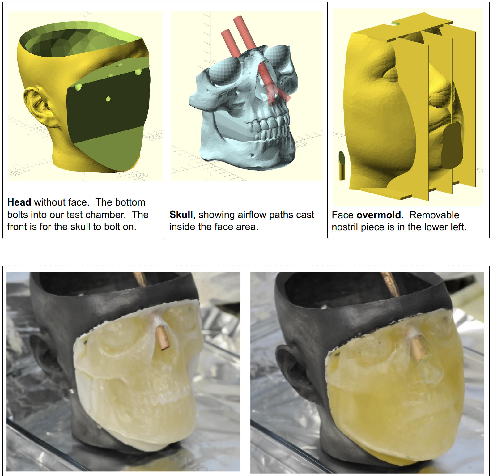

# Gelatin Mask-testing Head
For quantitative testing of masks, the standard NIOSH head models are made from solid rigid plastic.  Because this does not at all resemble human skin, the NIOSH N95 testing protocol allows the use of rope caulk and tape to provide a tight seal, which is not a good approximation for a human face.

This project contains a 3D printed set of parts and molds for casting a gelatin face for testing masks.  Because the face is cast from soft flexible gelatin, this better matches the compliance of a human face, which should give more accurate results when testing masks for fit and filtering effectiveness.

The face outer surface is currently built around the NIOSH "medium" head profile.

See the NioshMedium/ directory for CAD files of:
 * The "Head" without a face.  The head is normally printed from rigid plastic and holds the face in place, and provides a place for mask straps to attach.  There is a six-bolt hole pattern in the bottom of the head for mounting it into a test apparatus.  The top of the head is open to allow access to the back of the face, such as flowing in aerosols.
 * The "Skull" that gets bolted inside the face area.  This is printed from rigid plastic, and models the actual human skull areas that support the face while wearing a mask.
 * The "Overmold" is used to cast gelatin onto the skull while mounted on the head.
 

All of these parts should be printed as smooth and watertight as possible--casting gelatin will leak into non-watertight areas, resulting in much larger gelatin consumption.  The no-leak gelatin volume is 310cc, but 500cc is reasonable to account for leaks and spills.  Pre-chilling the mold can help somewhat with leaks.

After printing, the face overmold should be sealed and smoothed by applying several layers of high-build automotive primer paint.  A release layer of vaseline dissolved in volatile lamp oil should be applied to the inside of the face overmold.  The skull is then bolted to the face with a ¼" or 6mm plastic bolt (plastic is preferred over metal to reduce galvanic effects around the salty gelatin).

The air inlet tubes for the nostril or mouth inlets are ⅜" or 10mm outside diameter.  Conductive silicone is recommended: nonconductive plastic can accumulate an electrostatic charge, and metals can corrode.  The air inlet tub is inserted and aligned with the nostril plugs (verify inlet to nostril alignment with a lamp behind the overmold before pouring).  The inlet tube should be filled with a temporary ¼" or 6mm plastic tube to prevent it from getting filled with gel during casting.

The castable gelatin face composition is primarily water, with:
 * 10% w/v gelatin (Knox gelatin.  10% is the US federal standard ballistics testing gelatin concentration but is rather delicate; it may be worthwhile to upgrade this to 20% NATO gelatin for better handling properties.)
 * 10% w/v table salt, for electrical conductivity and biological decay resistance
 * 1% w/v sodium bicarbonate, to remain alkaline which increases the gelatin strength and reduces metal corrosion from the salt.  The solution is still quite corrosive, even to copper.

Casting protocol:
 * Mix gelatin with cold (5C) water first (like flour, the outside of a dry area will gel and prevent water accessing the interior unless you start cold).
 * Heat the gelatin to 45C, stir until gelatin is fully dissolved, add salt, stir until fully dissolved, filter
 * Ensure the overmold is face-down, with the head and skull inserted completely, and the nostril inlet tube aligned with the nostril plugs.
 * Carefully pour gelatin into the mold at about 30C gelatin temperature.
 * Chill the mold 10C for several hours to fully solidify before demolding.  The head needs to be treated gently, and kept in a cool environment: in a warm sunbeam for several hours it will melt off the skull.

Spray a clear rubbery sealant (Rustoleum LeakSeal, clear) directly onto the gelatin surface of the face to create a thin (approx 0.2mm) "skin" layer over the gelatin.  This substantially reduces abrasion damage to the face's surface while putting masks on and taking masks off, and has the added benefit of reducing water evaporation losses from the gelatin surface.  Masks also seem to seal better (by about 10%) against this surface than the bare gelatin.

The salt makes the face electrically conductive, but the plastic of the head is nonconductive, and hence static susceptible.  To reduce static, the hard plastic parts were fully painted in a dark graphite slurry consisting of:
 * Conductive finely ground graphite (agricultural EZ-Slide brand)
 * Acetone solvent
 * ABS 3D printer filament, chopped into pieces and dissolved into the acetone, to bind the dried graphite.
This combines to a sort of thin paint, although the graphite settles out rapidly and must be stirred up regularly.  Apply this fairly heavily and then buff off excess with steel wool, making a dark and rather metallic looking finish that electrically reads in the kilo-ohm range.

Explanation of these files and initial mask testing results are here:
https://docs.google.com/document/d/1Q9jaSaZRyKj-hi1BDpFaLHJNcuCx2OrSKFoyBqVJWUo/edit

"Human_Skull_Scan_fixed2" is a human skull model, license CC-A-NC, modified from:
    https://www.thingiverse.com/thing:2368585

This model was prepared by Orion Lawlor, lawlor@alaska.edu, in summer 2020 to help with COVID prevention.  Support for this project has been provided by the Office of Naval Research.  

